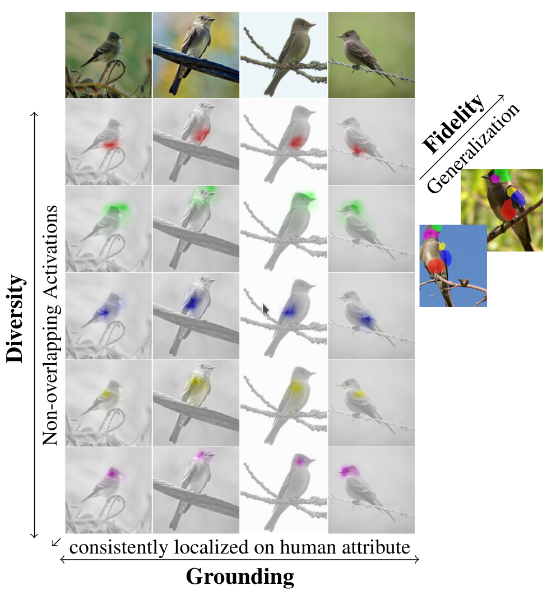

# Q-SENN - Quantized Self-Explaining Neural Networks

This repository contains the code for the AAAI 2024 paper 
[*Q-SENN: Quantized Self-Explaining Neural Network*](https://ojs.aaai.org/index.php/AAAI/article/view/30145) by Thomas
Norrenbrock , 
Marco Rudolph,
and Bodo Rosenhahn.
Additonally, the SLDD-model from [*Take 5: 
Interpretable Image Classification with a Handful of Features*](https://arxiv.org/pdf/2303.13166) (NeurIPS 
Workshop) from the same authors is included.


<p align="center">
     
</p>

---
Abstract:
>Explanations in Computer Vision are often desired, but most Deep Neural Networks can only provide saliency maps with questionable faithfulness. Self-Explaining Neural Networks (SENN) extract interpretable concepts with fidelity, diversity, and grounding to combine them linearly for decision-making. While they can explain what was recognized, initial realizations lack accuracy and general applicability. We propose the Quantized-Self-Explaining Neural Network Q-SENN. Q-SENN satisfies or exceeds the desiderata of SENN while being applicable to more complex datasets and maintaining most or all of the accuracy of an uninterpretable baseline model, out-performing previous work in all considered metrics. Q-SENN describes the relationship between every class and feature as either positive, negative or neutral instead of an arbitrary number of possible relations, enforcing more binary human-friendly features. Since every class is assigned just 5 interpretable features on average, Q-SENN shows convincing local and global interpretability. Additionally, we propose a feature alignment method, capable of aligning learned features with human language-based concepts without additional supervision. Thus, what is learned can be more easily verbalized.


---

## Installation
You will need the usual libaries for deep learning, e.g. pytorch, 
torchvision, numpy, etc. Additionally, we use 
[GLM-Saga](https://github.com/MadryLab/glm_saga) that can be installed via pip.
In case you are lazy (or like to spend your time otherwise), a suitable 
environment can be created using [Anaconda](https://www.anaconda.com/) and the 
provided environment.yml file:
```shell
conda env create -f environment.yml 
```

## Data
Supported datasets are:
- [Cub2011](https://www.vision.caltech.edu/datasets/cub_200_2011/)
- [StanfordCars](https://ai.stanford.edu/~jkrause/cars/car_dataset.html)
- [TravelingBirds](https://worksheets.codalab.org/bundles/0x518829de2aa440c79cd9d75ef6669f27)
- [ImageNet](https://www.image-net.org/)

To use the data for training, the datasets have to be downloaded and put into the 
respective folder under ~/tmp/datasets such that the final structure looks like

```shell
~/tmp/datasets
├── CUB200
│   └── CUB_200_2011
│       ├── ...
├── StanfordCars
│   ├── stanford_cars
│       ├── ...
├── TravelingBirds
│   ├── CUB_fixed
│       ├── ...
├── imagenet
│   ├── ...
```

The default paths could be changed in the dataset_classes or for Imagenet in 
get_data.py

Note: 
If cropped images, like for PIP-Net, ProtoPool, etc. are desired, then the 
crop_root should be set to a folder containing the cropped images in the 
expected structure, obtained by following ProtoTree's instructions: 
https://github.com/M-Nauta/ProtoTree/blob/main/README.md#preprocessing-cub, 
default path is: PPCUB200  instead of CUB200 for Protopool. Using these images 
can be set using an additional flag `--cropGT` introduced later.


## Usage
The code to create a Q-SENN model can be started from the file main.py.
Available parameters are:
- `--dataset`: The dataset to use. Default: Cub2011
- `--arch`: The backbone to use. Default: resnet50
- `--model_type`: The model type to use. Default: qsenn
- `--seed`: The seed to use. Default: None
- `--do_dense`: Whether to train the dense model. Default: True
- `--cropGT`: Whether to crop CUB/TravelingBirds based on GT Boundaries. Default: False
- `--n_features`: How many features to select. Default: 50
- `--n_per_class`: How many features to assign to each class. Default: 5
- `--img_size`: Image size. Default: 448
- `--reduced_strides`: Whether to use reduced strides for resnets. Default: False


For Example the next command will start the creation of Q-SENN with resnet50 on 
StanfordCars using the default arguments in the paper.
```shell
python main.py --dataset StanfordCars
```

**Note:**
All experiments on ImageNet in the paper skipped the dense training from 
scratch on ImageNet. The pretrained models are used directly.
This can be replicated with the argument --do-dense False.
## Citations
Please cite this work as:\
Q-SENN
```bibtex
@inproceedings{norrenbrock2024q,
  title={Q-senn: Quantized self-explaining neural networks},
  author={Norrenbrock, Thomas and Rudolph, Marco and Rosenhahn, Bodo},
  booktitle={Proceedings of the AAAI Conference on Artificial Intelligence},
  volume={38},
  number={19},
  pages={21482--21491},
  year={2024}
}
```
SLDD-Model
```bibtex
@inproceedings{norrenbrocktake,
  title={Take 5: Interpretable Image Classification with a Handful of Features},
  author={Norrenbrock, Thomas and Rudolph, Marco and Rosenhahn, Bodo},
  year={2022},
  booktitle={Progress and Challenges in Building Trustworthy Embodied AI}
}
```
## Pretrained Model
One pretrained model for Q-SENN on CUB can be obtained via this link: https://drive.google.com/drive/folders/1agWqKhcWOVWueV4Fzaowr80lQroCJFYn?usp=drive_link
## Acknowledgement
This work was supported by the Federal Ministry of Education and Research (BMBF), Germany under the AI service center KISSKI (grant no. 01IS22093C) and the Deutsche Forschungsgemeinschaft (DFG) under Germany’s Excellence Strategy within the Cluster of Excellence PhoenixD (EXC 2122).
This work was partially supported by Intel Corporation and by the German Federal Ministry
of the Environment, Nature Conservation, Nuclear Safety
and Consumer Protection (GreenAutoML4FAS project no.
67KI32007A). 

The work was done at the Leibniz University Hannover and published at AAAI 2024.

<p align="center">
     
    
    
</p>
